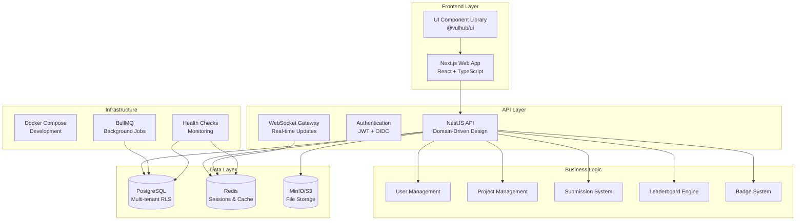
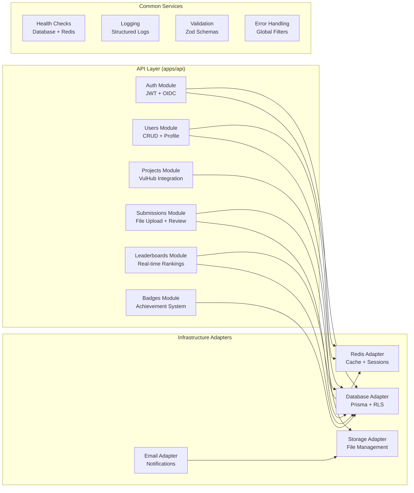
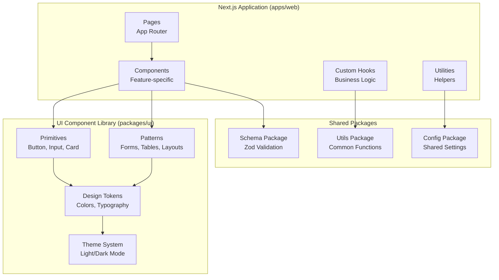

# 🏰 VulHub Leaderboard

**A modular, secure, and gamified platform for cybersecurity students to practice, compete, and grow.**

VulHub Leaderboard is a full-stack web application designed to track student progress on VulHub vulnerability challenges.  
It enables real-time leaderboards, secure authentication via CSUSB SSO, gamified achievements, and transparent scoring — all built with enterprise-level architecture principles and extensibility in mind.

---

## 📚 Table of Contents

1. [Overview](#-overview)
2. [Architecture Diagrams](#-architecture-diagrams)
3. [Development Status](#-development-status)
4. [Technology Stack](#-technology-stack)
5. [Monorepo Structure](#-monorepo-structure)
6. [Key Features](#-key-features)
7. [Security & Compliance](#-security--compliance)
8. [Development Setup](#-development-setup)
9. [Next Steps](#-next-steps)
10. [Contributing](#-contributing)
11. [License](#-license)

---

## 🧠 Overview

**Purpose:**  
To create a transparent, engaging, and secure leaderboard system that motivates students to learn offensive and defensive cybersecurity through VulHub projects.

**Vision:**  
A highly modular, auditable, and extensible platform where security students can:
- Learn ethical hacking in a safe, controlled environment.
- Compete for rankings and badges.
- Track personal progress and share verified achievements.
- Contribute plugins, modules, or themes without breaking core functionality.

---

## 🏗️ Architecture Diagrams

### **System Architecture Overview**


### **Domain-Driven Design Structure**


### **Frontend Architecture**


---

## 📊 Development Status

### **Current Progress: 60% Complete**

| Phase | Status | Progress | Description |
|-------|--------|----------|-------------|
| **Phase 1: Foundation** | ✅ Complete | 100% | Monorepo setup, core packages, database schema |
| **Phase 2: UI System** | ✅ Complete | 100% | Component library, design tokens, Storybook |
| **Phase 3: API Development** | 🚧 In Progress | 75% | NestJS API, authentication, user management |
| **Phase 4: Web Application** | 📋 Planned | 0% | Next.js frontend, user interfaces |
| **Phase 5: Advanced Features** | 📋 Planned | 0% | Real-time features, analytics, deployment |

### **Completed Features**

#### ✅ **Foundation & Infrastructure (Phase 1)**
- **Monorepo Setup**: PNPM workspaces with Turbo build system
- **Core Packages**: Config, schema, utils with TypeScript
- **Database Schema**: Prisma with multi-tenancy and RLS
- **Infrastructure**: Docker Compose for development environment
- **Documentation**: Comprehensive setup guides and scripts

#### ✅ **UI System & Design (Phase 2)**
- **Design Tokens**: Comprehensive color, typography, spacing system
- **Component Primitives**: Button, Input, Card, Badge, Avatar
- **Theme System**: Light/dark mode with CSS variables
- **Accessibility**: WCAG 2.1 AA compliant with ARIA support
- **Storybook**: Interactive component documentation
- **TypeScript**: Full type safety and IntelliSense

#### 🚧 **API Development (Phase 3 - 75% Complete)**
- **NestJS Foundation**: DDD architecture with modules and services
- **Authentication**: JWT with refresh tokens and OIDC ready
- **User Management**: Complete CRUD with tenant isolation
- **Database Integration**: Prisma with connection pooling
- **Redis Integration**: Caching and session management
- **API Documentation**: Swagger with interactive docs
- **Security**: Helmet, CORS, rate limiting, validation
- **Health Checks**: Database, Redis, and application monitoring

### **In Progress**

#### 🚧 **API Business Logic (Phase 3 - Remaining 25%)**
- **Project Management**: VulHub integration and CRUD operations
- **Submission System**: File upload, validation, and review workflow
- **Leaderboard Engine**: Real-time ranking calculations
- **Badge System**: Achievement tracking and assignment
- **WebSocket Events**: Real-time updates and notifications

### **Planned Features**

#### 📋 **Web Application (Phase 4)**
- **Next.js Frontend**: React with App Router
- **User Interfaces**: Dashboard, leaderboards, submissions
- **API Integration**: Client-side data fetching
- **Responsive Design**: Mobile-first approach
- **Authentication**: Login/logout with JWT

#### 📋 **Advanced Features (Phase 5)**
- **Real-time Updates**: Live leaderboard changes
- **Analytics**: User progress and engagement metrics
- **File Processing**: Image optimization and virus scanning
- **Email Notifications**: Automated alerts and updates
- **Performance**: Caching and optimization

---

## 🛠 Technology Stack

| Layer | Technology | Purpose | Status |
|-------|-------------|----------|--------|
| **Frontend** | Next.js 14 + React + TypeScript | SSR/ISR web app | 📋 Planned |
| **Styling** | TailwindCSS + shadcn/ui + CVA Variants | Modular, themeable design | ✅ Complete |
| **Backend API** | NestJS (TypeScript) | Domain-driven modular API | 🚧 75% Complete |
| **Database** | PostgreSQL + Prisma ORM | Relational data, migrations | ✅ Complete |
| **Cache / RT** | Redis | Caching, sessions, socket Pub/Sub | ✅ Complete |
| **Storage** | AWS S3 / MinIO | Secure evidence uploads | 🚧 In Progress |
| **Jobs** | BullMQ + Worker App | Background jobs & scheduling | 📋 Planned |
| **Authentication** | OIDC (CSUSB SSO) + JWT/Refresh | Secure user sessions | ✅ Complete |
| **Telemetry** | OpenTelemetry + Prometheus + Grafana | Monitoring & diagnostics | 📋 Planned |
| **Testing** | Jest + Playwright + Testcontainers + k6 | Unit, e2e, load, chaos testing | 📋 Planned |
| **CI/CD** | GitHub Actions + Vercel/Fly.io | Automated build, test, deploy | 📋 Planned |

---

## 🧩 Monorepo Structure

```bash
vulhub-leaderboard/
├─ apps/
│  ├─ web/                 # Next.js frontend (📋 Planned)
│  ├─ api/                 # NestJS backend (🚧 75% Complete)
│  └─ worker/              # BullMQ queue processors (📋 Planned)
│
├─ packages/
│  ├─ ui/                  # Design system primitives & patterns (✅ Complete)
│  ├─ schema/              # Zod + OpenAPI DTOs (✅ Complete)
│  ├─ utils/               # Isomorphic helpers & ports (✅ Complete)
│  ├─ config/              # Shared ESLint, TS, Tailwind configs (✅ Complete)
│  ├─ telemetry/           # OpenTelemetry setup (📋 Planned)
│  └─ plugins/             # Extension surface for badges, scoring, etc. (📋 Planned)
│
├─ prisma/                 # Database schema, seeds, migrations (✅ Complete)
├─ infra/                  # Docker, Terraform, K8s manifests (✅ Complete)
├─ scripts/                # Ingest VulHub, backfills, scaffolds (✅ Complete)
└─ docs/                   # ADRs, Dev Logs, Runbooks, Standards (✅ Complete)
```

### **Architecture Principles**
- **Separation of Concerns**: Clear module boundaries (application, domain, infrastructure)
- **Ports and Adapters**: External integrations defined as interfaces first
- **Event-Driven Core**: Transactional outbox with eventual consistency
- **Multi-Tenancy**: PostgreSQL RLS and scoped Prisma clients
- **Security by Default**: OWASP ASVS coverage, least-privilege everywhere
- **Observability**: Logs, traces, metrics, and correlation IDs from day one
- **Composable UI**: Slot-based and themable; primitives → patterns → features

---

## 🔐 Security & Compliance

### **Implemented Security Features**
- **Authentication**: JWT with refresh tokens and OIDC ready
- **Authorization**: Role-based access control (RBAC)
- **Multi-tenancy**: Row-Level Security (RLS) for tenant isolation
- **Input Validation**: Zod schemas with class-validator
- **Rate Limiting**: Request throttling and abuse prevention
- **Security Headers**: Helmet with CSP configuration
- **CORS**: Configurable cross-origin request handling

### **Planned Security Features**
- **File Upload Security**: Presigned uploads with AV scanning
- **Data Encryption**: Encryption at rest and in transit
- **Audit Logging**: Comprehensive audit trails
- **Compliance**: FERPA/GDPR compliance with privacy controls

---

## 🚀 Next Steps

### **Immediate Priorities (Next 2-4 Weeks)**

#### **Complete API Business Logic (Phase 3 - Remaining 25%)**
1. **Project Management Module**
   - [ ] VulHub integration and project CRUD operations
   - [ ] Project categorization and difficulty levels
   - [ ] Project metadata and requirements management

2. **Submission System**
   - [ ] File upload with validation and virus scanning
   - [ ] Submission review workflow for instructors
   - [ ] Evidence management and scoring

3. **Leaderboard Engine**
   - [ ] Real-time ranking calculations
   - [ ] Multiple leaderboard types (overall, project, category)
   - [ ] Performance optimization for large datasets

4. **Badge System**
   - [ ] Achievement criteria and tracking
   - [ ] Automated badge assignment
   - [ ] Badge metadata and display

5. **WebSocket Integration**
   - [ ] Real-time leaderboard updates
   - [ ] Live notifications
   - [ ] User presence and activity

#### **Start Web Application (Phase 4)**
1. **Next.js Setup**
   - [ ] Project initialization with App Router
   - [ ] TypeScript configuration
   - [ ] Tailwind CSS integration
   - [ ] UI component library integration

2. **Authentication Flow**
   - [ ] Login/logout pages
   - [ ] JWT token management
   - [ ] Protected routes
   - [ ] User session handling

3. **Core Pages**
   - [ ] Dashboard with user statistics
   - [ ] Leaderboard display
   - [ ] Project listing and details
   - [ ] Submission interface

### **Medium-term Goals (4-8 Weeks)**

#### **Complete Web Application (Phase 4)**
- [ ] **User Dashboard**: Personal statistics and progress
- [ ] **Leaderboard Interface**: Real-time rankings and filters
- [ ] **Project Management**: Browse and select projects
- [ ] **Submission System**: File upload and progress tracking
- [ ] **Profile Management**: User settings and preferences
- [ ] **Admin Panel**: User and content management

#### **Advanced Features (Phase 5)**
- [ ] **Real-time Updates**: Live leaderboard changes
- [ ] **Analytics Dashboard**: User engagement metrics
- [ ] **Email Notifications**: Automated alerts and updates
- [ ] **Performance Optimization**: Caching and CDN
- [ ] **Mobile Responsiveness**: PWA capabilities

### **Long-term Vision (8+ Weeks)**

#### **Production Deployment**
- [ ] **CI/CD Pipeline**: Automated testing and deployment
- [ ] **Monitoring**: OpenTelemetry and Grafana dashboards
- [ ] **Security**: Penetration testing and compliance
- [ ] **Performance**: Load testing and optimization
- [ ] **Documentation**: User guides and API documentation

#### **Advanced Features**
- [ ] **Team Competitions**: Group leaderboards
- [ ] **AI Integration**: Progress insights and recommendations
- [ ] **LMS Integration**: Canvas/Blackboard connectivity
- [ ] **Mobile App**: React Native or Flutter
- [ ] **Analytics**: Advanced reporting and insights

---

## 🧑‍💻 Development Setup

### **Quick Start**
```bash
# Clone and setup
git clone https://github.com/des-work/VulHub-LeaderBoard-Web.git
cd VulHub-LeaderBoard-Web

# Automated setup (Windows)
.\scripts\setup.ps1

# Automated setup (Unix)
./scripts/setup.sh

# Manual setup
pnpm install
pnpm dev:stack
pnpm db:migrate
pnpm db:seed
pnpm dev
```

### **Access Points**
- **Web App**: http://localhost:3000 (📋 Planned)
- **API**: http://localhost:4000/api/health
- **API Docs**: http://localhost:4000/api/docs
- **Database**: http://localhost:5555 (Prisma Studio)
- **Email**: http://localhost:8025 (MailHog)

### **Development Commands**
| Command | Description | Status |
|---------|-------------|--------|
| `pnpm dev` | Start all applications | ✅ Working |
| `pnpm dev:stack` | Start infrastructure services | ✅ Working |
| `pnpm build` | Build all packages | ✅ Working |
| `pnpm test` | Run all tests | 📋 Planned |
| `pnpm lint` | Lint and format code | ✅ Working |
| `pnpm db:migrate` | Run database migrations | ✅ Working |
| `pnpm db:seed` | Seed database with sample data | ✅ Working |
| `pnpm storybook` | View component library | ✅ Working |

---

## 🤝 Contributing

### **Development Workflow**
1. **Fork & Clone** the repository
2. **Create Feature Branch** from main
3. **Follow Coding Standards** (ESLint/Prettier)
4. **Write Tests** for new features
5. **Submit Pull Request** with description

### **Code Standards**
- **TypeScript**: Full type safety across all packages
- **ESLint**: Code quality enforcement
- **Prettier**: Consistent code formatting
- **Conventional Commits**: Standardized commit messages
- **Test Coverage**: > 80% for critical components

### **Documentation**
- **ADRs**: Architectural Decision Records for major changes
- **Dev Logs**: Daily development progress
- **API Docs**: Swagger/OpenAPI documentation
- **Component Docs**: Storybook for UI components

---

## 📜 License

MIT © 2025 — California State University, San Bernardino Cybersecurity Program
**Developed by students, for students** 🛡️

---

## 🎯 **Project Status Summary**

**Overall Progress**: 60% Complete  
**Current Phase**: API Development (75% Complete)  
**Next Milestone**: Complete API business logic and start web application  
**Target Completion**: Q2 2025  

The VulHub Leaderboard project has a solid foundation with comprehensive UI system and robust API architecture. The next phase focuses on completing the business logic and building the user-facing web application.

---

